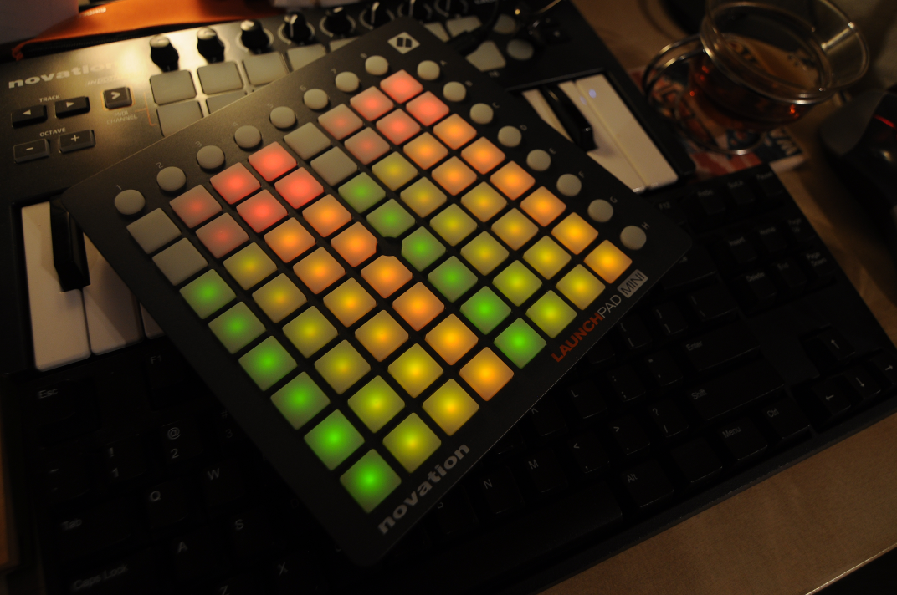
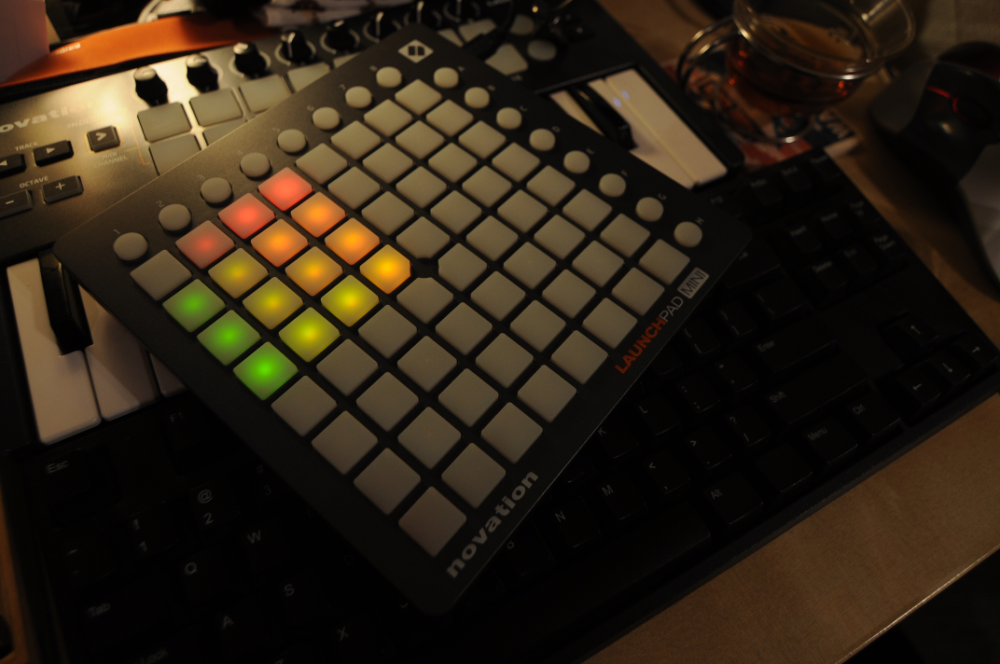

Title: MIDI RPG
Category: projects
Date: 2017-01-10 07:44:26
Status: published

Over new year I took some time to revisit my [MIDI Playground](http://bitbucket.org/j3hyde/midiplayground) where I put together toys and games using MIDI devices.  In this round I started to build a sort of dungeon RPG that is played on a [Launchpad Mini](https://global.novationmusic.com/launch/launchpad-mini).

This device presents some interesting constraints for small-scale game development:
* Grid space of just 8×8 plus one row and one column of "extra" buttons
* 16 colors from mixing 4 shades of green and red.
* MIDI throughput results in noticable latency when writing to the entire grid.

These gave me a comfortable sense of "you can't do too much" so that I could focus on (quickly?) building a simple space to explore.  The challenge would not lie in building a complex graphics engine but in designing a mechanic that was compelling.

# Entering the Space; or Interfacing with the Launchpad Mini

Fortunately I still had my prior endeavor laying around as a starting point and that made it much easier to get going.  I had implemented Conway's Game of Life with a layer that took care of converting grid output to MIDI and MIDI input to an InputEvent object.  That led me to the next task of determining what colors I actually had to work with.

After refactoring some of that MIDI layer I opened up a Python interactive prompt, imported by MIDI UI module, and started writing out values to the entire grid in a sequence:

    :::Python
    >>> from rpg import MidiDriver
    >>> MidiDriver.list_devices()
    [('MMSystem', 'Microsoft MIDI Mapper', 0, 1, 0), ('MMSystem', 'Launchpad Mini', 1, 0, 0), ('MMSystem', 'Microsoft GS Wavetable Synth', 0, 1, 0), ('MMSystem', 'Launchpad Mini', 0, 1, 0)]
    >>> md = MidiDriver(1, 3)
    Opening devices:
            in: 1, <pypm.Input object at 0x02A03548>
            in: 3, <pypm.Output object at 0x02A03380>
    >>> [md.set(x%8, x/8, x) for x in range(64)]
    >>> md.commit()

This resulted in a nice — albeit repeated — semi-rainbow pattern:

What I found interesting here was that each row is repeated and then the four columns are also repeated.  Ultimately I found that it was 16 colors produced by combining four levels each of green and red (from off through three levels of brightness).  After some fiddling I reduced the color formula to this:

    >>> [md.set(x%4, x/4, x % 4 + x/4*16) for x in range(16)]
    [None, None, None, None, None, None, None, None, None, None, None, None, None, None, None, None] 
    >>> md.commit()

At first these values seemed somewhat arbitrary but it's easier to see the pattern with the binary values.  The code above writes the following values out:

<table>
<tr><th>Decimal</th><th>Binary</th></tr>
<tr><td> 0</td><td>0000 0000</td></tr>
<tr><td> 1</td><td>0000 0001</td></tr>
<tr><td> 2</td><td>0000 0010</td></tr>
<tr><td> 3</td><td>0000 0011</td></tr>
<tr><td>16</td><td>0001 0000</td></tr>
<tr><td>17</td><td>0001 0001</td></tr>
<tr><td>18</td><td>0001 0010</td></tr>
<tr><td>19</td><td>0001 0011</td></tr>
<tr><td>32</td><td>0010 0000</td></tr>
<tr><td>33</td><td>0010 0001</td></tr>
<tr><td>34</td><td>0010 0010</td></tr>
<tr><td>35</td><td>0010 0011</td></tr>
<tr><td>48</td><td>0011 0000</td></tr>
<tr><td>49</td><td>0011 0001</td></tr>
<tr><td>50</td><td>0011 0010</td></tr>
<tr><td>51</td><td>0011 0011</td></tr>
</table>

Basically the higher four bits are used for the green LED while the lower four bits are used for the red one.  However, since only four levels are used for each, the upper two bits of each nibble is essentially dropped on the floor.  Thus, decimal 4 (binary 0000 0100) has the same effect as decimal 0 and decimal 87 (binary 0101 0111) has the same effect as decimal 19 (0001 0011).

So that gave me a palette to work with.  Following that I dug into building a suitable game engine (of sorts).  One of the challenges I set out to solve was the MIDI latency.

# MIDI Latency

Basically if you write out too all of the LEDs at the same time then you can watch the update flow across the device.  For aesthetic reasons I really didn't want to draw the entire grid every frame as it'd simply be too obvious.  My approach was to flip the "normal" draw cycle on its head and only draw an object when it was changed.  Basically it's putting the game into immediate mode drawing instead of stored mode.

To implement this the grid — a container for game objects — is set to listen for changes on each of its subordinate objects.  In turn there is a view object that listens to the grid.  In the end, one a game object's `value` property changes, a change event is bubbled up until it gets written out to the device.  In the case of the player moving, the value of the square it is leaving is also updated.

As this is a turn-based game, game objects don't think until the player takes an action.  To accomodate animation (mainly for a fire effect so far) the game loop calls an animate method on each game object to give them the opportunity to update their value.  As far as the game is concerned though, they don't change state.  In the case of that fire object, it changes value every quarter second and that value bubbles up until the color of its square is updated.

# Color Tweaks

To work with the limited palatte, I figured I'd make the "floor" of the rooms black (i.e. no LEDs on), I'd set the "walls" (by default along the edges) to some color, perhaps set doors to black as well, the player to something reasonable, etc.  But I wasn't sure up front which objects should be what color.  Again, MIDI to the rescue.

For some time I've been intrigued by the ease with which Digital Audio Workstations (DAWs) — such as Ableton Live — allow you to assign MIDI controls to settings.  You click a button to say "I'm mapping a MIDI control now", turn the physical control you want to use, and voila it's assigned.

Using a LaunchKey Mini as a MIDI input, I set each of it's eight knobs to select the color of a different object.  I twist one knob to change the player color and another to adjust the wall color etc.

    :::Python
    class MidiTweakDriver(object):
      def __init__(self, device_id):
        self.device = pypm.Input(device_id)

      def get(self):
        '''Gets a list of all currently available UI events.'''
        events = []
        while self.device.Poll():
          for e in self.device.Read(1):
            control, value = self.map_midi_to_ui(e)
            events.append((control, value))
        return events

      @classmethod
      def map_midi_to_ui(cls, message):
        '''Maps MIDI message to control and value.'''
        
        cmd = message[0][0] & 0b11110000
        channel = message[0][0] & 0b1111
        control = message[0][1] & 0b01111111
        value = message[0][2] & 0b01111111

        if cmd == 0b10110000:
          return control - 21, value
        else:
          return None

That chunk of code could use some work but it was enough to allow tweaking of the 16 colors for each object.  Let's walk through it:

`pypm.Input(device_id)` opens a MIDI device for input.  Pretty simple really.

In the `get()` method I'm just polling for any ready MIDI messages and then reading each one off.  For each of those messages I call `map_midi_to_ui(message)` which does some minor parsing on the control message.

Those events are used in the main game loop like so:

    :::Python
    tweak_map = [
        (Player, '_value'),
        (Monster, '_value'),
        (Wall, '_value'),
        (Door, '_value'),
        (Pickup, '_value'),
        (Fire, 'min_value'),
        (Fire, 'max_value'),
    ]

    events = self.tweak.get()
    for control, value in events:
        if control >= 0 and control < len(tweak_map):
            value = value%4 + value/4*16

            setattr(tweak_map[control][0], tweak_map[control][1], value)
            for entity in self.model.get_all_by_type(tweak_map[control][0]):
                entity.notify()

Firstly there is a mapping that takes the MIDI control index (from 0 to 7) and gives the game object class as well as the property of the corresponding class that should be tweaked.  In this case I was okay with the hacky "set a class property for global tweaks" as I really just wanted to see the changes across the game and I didn't really intend to keep the functionality around long term.

Next, for each event I reduce the value range down to the 16 possible values that we can use for color output:  0-3, 16-19, 32-35, 48-51.  I use setattr to blindly set the mapped property (e.g. `_value`, `min_value`, or `max_value`) and finally find every entity for the matched game object class and call `notify()` to ensure the updated value is written out to the game board.

# Conclusion

I continue to find that MIDI devices as a game space are quite interesting.  They make it pretty easy to get input yet they aren't designed for game control at all.  I think this opens the way for engaging projects.

Additionally, despite wanting to use these devices as tweak controls during development for a long long time this is the first time I've actually done it.  It was straight-forward to add to the game and gave me immediate feedback from a tactile input:  I could turn a knob and see the change in game world.  In future projects I will have to consider how to build-in a flexible tweak system in early in the development process.
